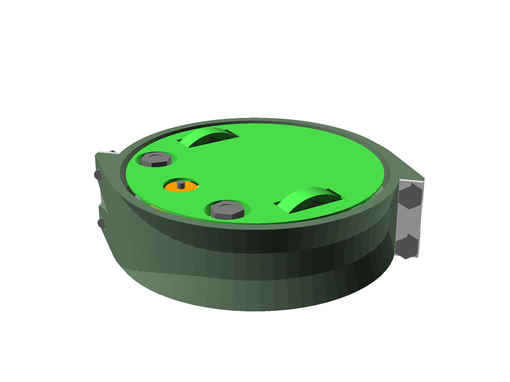
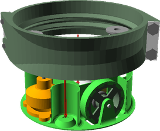
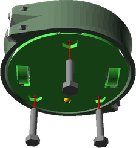
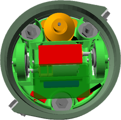
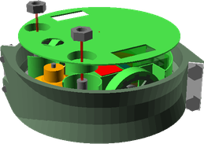

# GyroAnt
# Assembly Guide

## Bill of Materials

Make sure you have all of the following parts before you begin.

### Vitamins

Qty | Vitamin | Image
--- | --- | ---
1 | [C2020 Micro Brushless Outrunner 3500kv 11g]() |  | 
1 | [DYS BLHeli 16A ESC]() |  | 
1 | [DasMikro Ultra Mini 8CH PPM Receiver]() |  | 
2 | [N20DCGearMotor]() |  | 
2 | [O-Ring 2x10]() |  | 
2 | [Stainless steel Round Bar 2mm x 100mm]() |  | 
2 | [TowerPro SG90 Driver]() |  | 
1 | [Turnigy Nano-Tech 120mAh 2S 25C Lipo Pack E-Flite Compatible]() |  | 
3 | [624VV 4x13x6mm V Groove Sealed Ball Bearing]() |  | 
5 | [M4 Nut]() |  | 
4 | [M3 hex screw x 8mm]() |  | 
1 | [M4 hex screw x 15mm]() |  | 
2 | [M4 hex screw x 19mm]() |  | 

### Cut Parts

Qty | Part Name | Image
--- | --- | ---
2 | Axle |  | 

### Printed Parts

Qty | Part Name | Image
--- | --- | ---
1 | [Base](../printedparts/stl/Base.stl) |  | 
1 | [Lid](../printedparts/stl/Lid.stl) |  | 
1 | [WeaponRing](../printedparts/stl/WeaponRing.stl) |  | 
2 | [Wheel](../printedparts/stl/Wheel.stl) |  | 

**Plastic Required**

21.0cm3, 0.03KG,  approx: 0.34 GBP

# Cutting Instructions

## Axle (x2)

### Vitamins

Qty | Vitamin | Image
--- | --- | ---
2 | [Stainless steel Round Bar 2mm x 100mm]() |  | 

### Fabrication Steps

1. Start with rod of 2mm steel or similar

2. Cut off a 14mm length

# Assembly Instructions

## Final

### Vitamins

Qty | Vitamin | Image
--- | --- | ---
1 | [C2020 Micro Brushless Outrunner 3500kv 11g]() |  | 
1 | [DYS BLHeli 16A ESC]() |  | 
1 | [DasMikro Ultra Mini 8CH PPM Receiver]() |  | 
2 | [N20DCGearMotor]() |  | 
2 | [O-Ring 2x10]() |  | 
2 | [TowerPro SG90 Driver]() |  | 
1 | [Turnigy Nano-Tech 120mAh 2S 25C Lipo Pack E-Flite Compatible]() |  | 
3 | [624VV 4x13x6mm V Groove Sealed Ball Bearing]() |  | 
5 | [M4 Nut]() |  | 
4 | [M3 hex screw x 8mm]() |  | 
1 | [M4 hex screw x 15mm]() |  | 
2 | [M4 hex screw x 19mm]() |  | 

### Printed Parts

Qty | Part Name | Image
--- | --- | ---
1 | [Base](../printedparts/stl/Base.stl) |  | 
1 | [Lid](../printedparts/stl/Lid.stl) |  | 
1 | [WeaponRing](../printedparts/stl/WeaponRing.stl) |  | 
2 | [Wheel](../printedparts/stl/Wheel.stl) |  | 

### Assembly Steps

1. Locate wheels and insert axles

2. Fit motors and o-rings

3. Fit weapon outrunner

4. Slide weapon ring over base, along with v bearings

5. Secure bearings for weapon ring

6. Wire up Rx, ESCs and motors

7. Install battery

8. Fit lid

