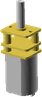

# GyroAnt
# Sourcing Guide

### 1x C2020 Micro Brushless Outrunner 3500kv 11g

Unit Cost | Source | Notes 
--- | --- | --- 
10.00 | [link](http://hobbyking.com) | 

 

### 1x DYS BLHeli 16A ESC

Unit Cost | Source | Notes 
--- | --- | --- 
0 |  | No sources found

 

### 1x DasMikro Ultra Mini 8CH PPM Receiver

Unit Cost | Source | Notes 
--- | --- | --- 
0 |  | No sources found

 

### 2x N20DCGearMotor

Unit Cost | Source | Notes 
--- | --- | --- 
0 |  | No sources found

 

### 2x O-Ring 2x10

Unit Cost | Source | Notes 
--- | --- | --- 
0 |  | No sources found

 

### 2x Stainless steel Flat Bar 6x1mm x 21mm

Unit Cost | Source | Notes 
--- | --- | --- 
0 |  | No sources found

 

### 2x Stainless steel Round Bar 2mm x 14mm

Unit Cost | Source | Notes 
--- | --- | --- 
0 |  | No sources found

 

### 2x TowerPro SG90 Driver

Unit Cost | Source | Notes 
--- | --- | --- 
0 |  | No sources found

 

### 1x Turnigy Nano-Tech 120mAh 2S 25C Lipo Pack E-Flite Compatible

Unit Cost | Source | Notes 
--- | --- | --- 
0 |  | No sources found

 

### 3x 624VV 4x13x6mm V Groove Sealed Ball Bearing

Unit Cost | Source | Notes 
--- | --- | --- 
0 |  | No sources found

 

### 5x M4 Nut

Unit Cost | Source | Notes 
--- | --- | --- 
0 |  | No sources found

 

### 4x M3 hex screw x 8mm

Unit Cost | Source | Notes 
--- | --- | --- 
0 |  | No sources found

 

### 1x M4 hex screw x 15mm

Unit Cost | Source | Notes 
--- | --- | --- 
0 |  | No sources found

 

### 2x M4 hex screw x 19mm

Unit Cost | Source | Notes 
--- | --- | --- 
0 |  | No sources found

 

## Summary

### Total Costs

Metric | Value 
--- | --- 
Total Vitamins | 29
Total Cost (cheapest) | 10.0 GBP

